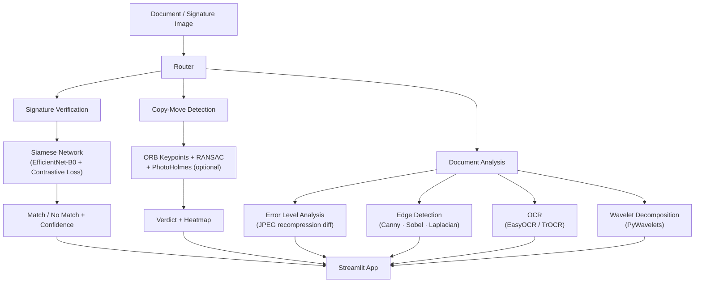

# VeriLogic — AI-Based Fake Identity & Document Screening

A modular, offline-first system for screening identity documents. Combines forensic image analysis
(ELA, copy-move, wavelet), OCR, deterministic field-logic checks, and a tamper-evident audit trail
into one unified verdict — built for SIH26188.

> **Live Demo:** [Open VeriLogic on Streamlit](https://commit-chill-ljf9dpisbrdnw2rc9wbrma.streamlit.app/)

> **Note:** This repository also contains an unrelated developer-wellbeing dashboard (the optional
> wellness tab) from an earlier hackathon iteration. It is not part of the VeriLogic submission and
> should be removed or split out before final submission.

## Why this is different

- **Read vs. Trust reconciliation** — cross-checks what a field *says* (OCR) against how it *looks*
  (pixel forensics), flagging mismatches rather than scoring each in isolation.
- **Indic-script SDGI probe** — tuned to how AI-inpainting can disturb Indic-script text geometry,
  including matra/diacritic spacing, rather than relying only on generic Latin-text tampering cues.
- **Deterministic logic engine** — training-free checksum, date, PAN, and cross-field checks catch
  inconsistencies a purely visual classifier misses.
- **Tamper-evident audit trail** — every decision is hash-chained (`.docauth/audit.jsonl`) and
  independently verifiable with `uv run python -m src.audit verify .docauth/audit.jsonl`.
- **Honest about limits** — SDGI and tamper scoring are explicitly heuristic/baseline signals until
  trained and validated; they are never the sole basis for a fraud decision.

The staged document ML plan, dataset manifest workflow, MRZ validation, model contracts, and
privacy boundaries are documented in [docs/ML_PIPELINE.md](docs/ML_PIPELINE.md).

## VeriLogic Unified Screening Workflow

The **AI Screening** tab follows **Upload → Analyze → One unified report**. It combines ELA,
copy-move, OCR, wavelet, MRZ, deterministic identity checks, Read-vs-Trust reconciliation,
calibrated review buckets, perceptual-hash cross-case lookup, and the append-only audit chain.

## Supporting Forensic Modules

The signature, copy-move, ELA, edge, OCR, and wavelet tools below are the supporting modules that
VeriLogic's unified screening pipeline draws on.

## Architecture



Run it with `uv run streamlit run app.py`. OCR is opt-in because EasyOCR may download its model
on first use. Face liveness/WebRTC and Google Cloud Vision remain optional integrations; the
offline workflow does not claim liveness from a still image. The proposed Next.js/FastAPI split is
the production migration boundary; this repository remains the offline-first reference engine.

---

## Technology Stack

| Component | 2025/2026 Approach | Key Library |
|---|---|---|
| **Signature Verification** | Siamese Network + EfficientNet-B0 backbone + Contrastive Loss | `torch`, `timm`, `pytorch-metric-learning` |
| **Copy-Move Detection** | ORB keypoints + RANSAC homography · PhotoHolmes (Splicebuster) | `opencv-python`, `photoholmes` |
| **Error Level Analysis** | JPEG recompression differential map | `Pillow` |
| **Edge Detection** | Canny (Otsu-adaptive) · Sobel · Laplacian · Prewitt | `opencv-python` |
| **OCR** | EasyOCR (printed) · TrOCR (handwritten) | `easyocr`, `transformers` |
| **Wavelet Analysis** | Multi-level Haar/Daubechies/Symlet decomposition | `PyWavelets` |
| **Web UI** | Streamlit multi-tab app | `streamlit` |
| **Packaging** | `pyproject.toml` + `uv` · Docker | `hatchling` |
| **Python** | ≥ 3.11 | — |

---

## Quick Start

### Option 1 — pip

```bash
git clone https://github.com/AtreyDev/Commit-chill.git
cd Commit-chill
pip install -r requirements.txt
streamlit run app.py
```

### Option 2 — uv (recommended, 10× faster installs)

```bash
curl -LsSf https://astral.sh/uv/install.sh | sh
uv sync
uv run streamlit run app.py
```

### Option 3 — Docker

```bash
docker build -t verilogic .
docker run -p 8501:8501 verilogic
```

Open **http://localhost:8501** to access the three-tab interface.

---

## Repository Structure

```
Commit-chill/
├── src/
│   ├── signature/
│   │   ├── model.py          # Siamese network (timm EfficientNet-B0)
│   │   ├── dataset.py        # CEDAR-compatible dataset loader + albumentations
│   │   ├── train.py          # Training script
│   │   └── inference.py      # Public verification API
│   ├── copy_move/
│   │   ├── detector.py       # PhotoHolmes + ORB+RANSAC fallback
│   │   └── visualizer.py     # Heatmap and annotation utilities
│   └── analysis/
│       ├── ela.py            # Error Level Analysis
│       ├── edge_detection.py # Multi-detector edge analysis
│       ├── ocr.py            # EasyOCR + TrOCR dual-engine
│       └── wavelet.py        # PyWavelets decomposition
├── notebooks/
│   ├── 01_signature_siamese.ipynb       # Siamese net training & ROC curve
│   ├── 02_copy_move_detection.ipynb     # ORB+RANSAC visualisation
│   ├── 03_ela_analysis.ipynb            # ELA + wavelet + OCR
│   └── 04_full_pipeline_demo.ipynb      # End-to-end forensic report
├── tests/
│   ├── test_signature.py
│   ├── test_copy_move.py
│   └── test_analysis.py
├── .streamlit/config.toml
├── app.py                    # Streamlit entry point
├── pyproject.toml
├── requirements.txt
└── Dockerfile
```

---

## Modules

### 1. Signature Verification

A **Siamese neural network** learns to embed signatures into a metric space where genuine
signatures from the same writer cluster together and forged ones are pushed apart.

- **Backbone**: EfficientNet-B0 via `timm` (pretrained on ImageNet, fine-tuned on signature data)
- **Loss**: Contrastive loss (`pytorch-metric-learning`)
- **Threshold**: Cosine similarity ≥ 0.50 → Genuine
- **Dataset format**: CEDAR-compatible directory (genuine-\*.png / forged-\*.png per writer)

**Train:**

```bash
python -m src.signature.train \
    --data-dir "Signature Detection and Analysis/data" \
    --epochs 30 \
    --backbone efficientnet_b0 \
    --output weights/siamese_best.pt
```

**Inference:**

```python
from src.signature.inference import verify

result = verify("reference.png", "query.png", weights="weights/siamese_best.pt")
# {"match": True, "confidence": 0.87, "distance": 0.13, "verdict": "Genuine"}
```

### 2. Copy-Move Detection

Detects regions that have been duplicated within a document image.

**Two-tier approach:**
1. **PhotoHolmes** — `pip install photoholmes` — 10 state-of-the-art forensics methods (Splicebuster, NoiseSniffer, …)
2. **ORB + RANSAC fallback** — interpretable, no extra dependencies beyond OpenCV

```python
from src.copy_move.detector import detect_copy_move

result = detect_copy_move("cheque.png")
# {"verdict": "Forged", "score": 0.72, "mask": <ndarray>, "method": "orb_ransac"}
```

### 3. Document Analysis

Four independent analysis tools applied to any document image:

| Tool | Description |
|---|---|
| **ELA** | Highlights pixels with anomalous JPEG compression levels — indicates spliced regions |
| **Edge Detection** | Canny (Otsu-adaptive), Sobel, Laplacian, Prewitt — structural integrity checks |
| **OCR** | EasyOCR for printed text; TrOCR (`microsoft/trocr-base-handwritten`) for handwriting |
| **Wavelet** | Multi-level Haar/Daubechies decomposition — surfaces high-frequency tampering artefacts |

```python
from src.analysis.ela import generate_ela, ela_score
from src.analysis.ocr import extract_text

ela_map = generate_ela("document.jpg", quality=95, scale=15)
score   = ela_score(ela_map)       # float in [0, 1]

ocr = extract_text("document.jpg", handwritten=False)
print(ocr["full_text"])
```

---

## Forgery Scoring Thresholds

| Score | Verdict |
|---|---|
| 0 – 10% | Authentic |
| 10 – 55% | Suspicious |
| 55 – 100% | Forged |

---

## Training Data

The repository includes sample signature data for writer **021**:

```
Signature Detection and Analysis/data/test/021/
  genuine-01.png … genuine-12.png
  forged-01.png  … forged-06.png
```

For full training, download the **CEDAR** dataset (public, 55 writers):
https://cedar.buffalo.edu/NIJ/data/signatures.rar

---

## Development

```bash
pip install -e ".[dev]"
pytest tests/ -v
ruff check src/ tests/
```

---

## References

| Paper | Year | Contribution |
|---|---|---|
| HTCSigNet — Pattern Recognition | 2025 | Hybrid Transformer-Conv signature network |
| Multi-Scale CNN-CrossViT — Complex & Intelligent Systems | 2025 | 98.85% accuracy on CEDAR |
| CMFDFormer — arXiv 2311.13263 | 2023 | MiT transformer backbone for copy-move detection |
| PhotoHolmes — arXiv 2412.14969 / Springer | 2025 | Unified image forensics Python library |
| MVSS-Net++ — T-PAMI | 2022 | Multi-view multi-scale forgery supervision |
| TransOSV — Pattern Recognition | 2023 | First ViT-based writer-independent verification |
| Farid, H. — IEEE Signal Processing Magazine | 2009 | ELA and image forgery detection foundations |
| ELA + ResNet50 + CBAM — PMC 11323046 | 2024 | 96.21% accuracy on CASIA v2 |

---

## License

[MIT](LICENSE) © 2026 Atrey
